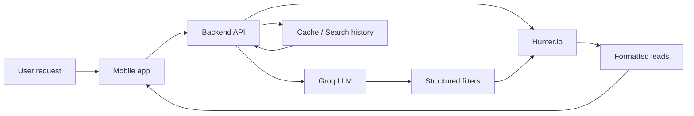

# Outreach

Outreach is a mobile-first lead discovery app that lets users describe the kind of people or companies they want to reach in plain English and receive relevant leads in return. The experience is built around a conversational chat flow, where natural-language requests are interpreted into structured filters and then used to search lead data.

This repository contains two parts:

- a React Native mobile app built with Expo
- a Node.js backend that parses queries, calls external APIs, and stores search history/cache data

## Table of contents

- [Overview](#overview)
- [Features](#features)
- [Architecture](#architecture)
- [Project structure](#project-structure)
- [Quick start](#quick-start)
- [Backend setup](#backend-setup)
- [Mobile app setup](#mobile-app-setup)
- [Optional Supabase setup](#optional-supabase-setup)
- [API overview](#api-overview)
- [Troubleshooting](#troubleshooting)

## Overview

The app is designed for sales, recruiting, and growth teams who want to quickly find relevant contacts without manually building complex search filters.

A typical flow looks like this:

1. A user types a request such as “marketing leaders at fintech startups in the US”.
2. The backend sends that request to Groq, which converts it into structured search filters.
3. The backend queries Hunter.io for matching people or organizations.
4. Results are returned to the mobile app and shown in a chat-style experience.
5. The user can browse more results, copy an email, open LinkedIn, or revisit past searches.

## Features

- Natural-language lead search
- AI-powered filter interpretation with Groq
- Lead discovery through Hunter.io
- Chat-style results experience
- Pagination for larger result sets
- Quick actions for leads such as copying an email or opening a website
- Search history and replay
- Server-side caching to reduce repeated API calls
- Optional Supabase support for persistent history and cache storage

## Architecture



### How the pieces fit together

- The mobile app stays lightweight and focuses on the user experience.
- The backend handles AI parsing, API integration, validation, caching, and history.
- External API keys remain on the server side, not inside the mobile app.

## Project structure

```text
backend/
  server.js
  src/
    app.js
    config/
    lib/
    middleware/
    routes/
    services/
    utils/
  scripts/
  supabase/

mobile/
  app.json
  package.json
  src/
    app/
    components/
    constants/
    lib/
```

### Backend responsibilities

- request routing and validation
- natural-language parsing with Groq
- lead search integration with Hunter.io
- caching and search history
- error handling and rate limiting

### Mobile responsibilities

- chat-style UI for queries and results
- interpreted filter display
- lead cards and pagination
- lead actions like copy/open links
- history screen and re-run flow

## Quick start

### Prerequisites

Make sure you have:

- Node.js 18.17 or newer
- npm
- an Expo environment for running the mobile app

## Backend setup

### 1. Install dependencies

```bash
cd backend
npm install
```

### 2. Create environment variables

Create a `.env` file in the backend folder with the following values:

```env
GROQ_API_KEY=your_groq_api_key
HUNTER_API_KEY=your_hunter_api_key

# Optional
SUPABASE_URL=your_supabase_url
SUPABASE_SECRET_KEY=your_supabase_secret_key
PORT=3000
```

### 3. Run the backend

```bash
npm run dev
```

Or:

```bash
npm start
```

The server will start on port `3000` by default.

### 4. Verify the backend

```bash
curl http://localhost:3000/health
```

### Useful backend scripts

```bash
npm run check
npm run smoke
```

- `check` runs offline validation for the app and routes.
- `smoke` runs live requests against Groq and Hunter.io and uses real API credits.

## Mobile app setup

### 1. Install dependencies

```bash
cd mobile
npm install
```

### 2. Start the Expo app

```bash
npx expo start
```

### 3. Connect the app to the backend

The mobile app will try to reach the backend on port `3000` by default. If you are testing on a physical phone, you may need to set an explicit API URL:

```bash
EXPO_PUBLIC_API_URL=http://YOUR_LOCAL_IP:3000 npx expo start
```

### 4. Use the app

Once the app is running:

- enter a plain-English search request
- review the interpreted filters
- browse the returned leads
- tap a lead to copy an email or open a profile/site
- open the history screen to re-run previous searches

## Optional Supabase setup

If you want persistent search history and cached results, configure Supabase.

1. Create a Supabase project.
2. Run the SQL from [backend/supabase/schema.sql](backend/supabase/schema.sql).
3. Add the following values to the backend environment:

```env
SUPABASE_URL=your_supabase_url
SUPABASE_SECRET_KEY=your_supabase_secret_key
```

If these values are not provided, the app will fall back to in-memory storage.

## API overview

The backend exposes a simple API that powers the mobile app:

- `POST /api/parse-query` converts natural language into structured filters
- `POST /api/search-leads` runs the lead search using parsed filters
- `GET /api/searches` returns recent saved searches
- `GET /health` checks backend health and configuration status

## Troubleshooting

### The mobile app cannot reach the backend

- make sure the backend is running
- confirm the backend is listening on port `3000`
- if testing on a phone, set `EXPO_PUBLIC_API_URL` to your machine’s local IP address

### Hunter.io or Groq requests fail

- verify your API keys in the backend `.env` file
- check whether your plan or quota allows the requested action

### No history appears

- history only works when Supabase is configured
- otherwise the app will still run, but search history will not be persisted

## Summary

Outreach combines AI, lead-search APIs, and a mobile interface into one workflow: describe who you want to reach, and the app helps you find the right people.

If you are a new contributor, start with the backend for parsing and provider logic, then explore the mobile app for the user experience and screens.
